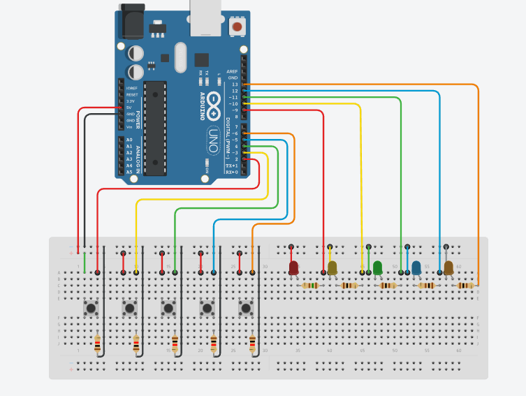

## Projet Arduino : Contrôle de 5 LEDs avec 5 boutons-poussoirs

Ce projet Arduino se concentre sur le contrôle de 5 LEDs à l'aide de 5 boutons-poussoirs. Il est développé en utilisant le langage de programmation C++.

### Utilisation

1. Connectez votre Arduino à votre ordinateur et ouvrez le fichier `nom-du-fichier.ino` avec l'IDE Arduino.
2. Assurez-vous de sélectionner le bon port série dans l'IDE Arduino.
3. Téléversez le code sur votre Arduino.
4. Connectez les LEDs et les boutons-poussoirs aux broches appropriées de l'Arduino en vous référant au schéma de câblage fourni dans le dossier `src`.
5. Alimentez votre Arduino.
6. Appuyez sur les boutons-poussoirs pour allumer ou éteindre les LEDs correspondantes.

### Schéma de câblage

### Matériel requis

- Arduino Uno
- 5 LEDs
- 5 boutons-poussoirs
- Résistances appropriées pour les LEDs et les boutons-poussoirs
- Câbles de connexion

### Language 

 - C++

### Auteur

Ce projet a été réalisé par [ThomasHNI].

---

©️ [ThomasHNI] - 2023
